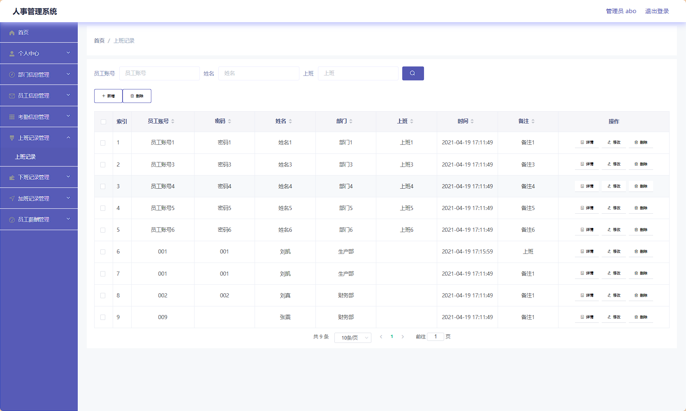
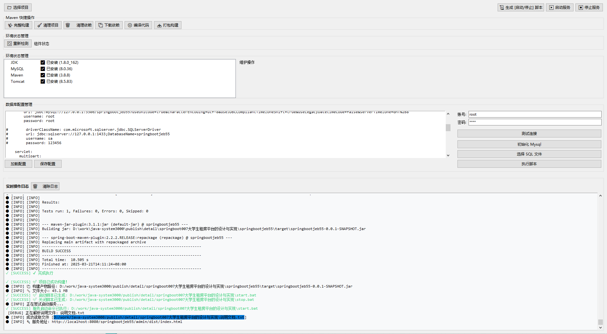

# springboot-人事管理系统 / springboot-HRMS

 
 
 
 
 
 
 
 


> 更多毕设项目可跳转至项目导航栏检索：[毕设项目](http://sysadmin.3vfree.vip)，需要联系博主v：xq-lucky311，q：1047944234

## 项目简介  
基于 SpringBoot 2.7+ 和 Vue 2.x 的 B/S 架构人事管理系统，采用 SSM 框架实现部门管理、考勤记录、薪酬计算等核心功能，支持管理员与员工双角色权限控制，提供前后端分离的企业级解决方案。

  
- ​**​后端框架​**​：SpringBoot 2.7+ / MyBatis-Plus 2.3 / Shiro 1.3.2  
- ​**​前端框架​**​：Vue 2.x + ElementUI  
- ​**​数据库​**​：MySQL 5.7+  
- ​**​工具链​**​：Hutool 4.0 / Fastjson 1.2 / Apache Commons  

## 特征介绍  
- ​**​RBAC 权限体系​**​：集成 Shiro 实现动态菜单权限控制，支持管理员与员工角色分离  
- ​**​考勤全流程​**​：完整覆盖上班打卡、下班签退、加班申请记录功能模块  
- ​**​智能薪酬计算​**​：自动关联考勤数据计算基本工资、全勤奖、加班补贴等薪酬项  
- ​**​多维度报表​**​：部门统计视图与员工个人考勤日历双维度数据展示  
- ​**​高效开发架构​**​：MyBatis-Plus 实现零 SQL 单表操作，集成代码生成器加速开发  
- ​**​文件管理​**​：独立 FileController 支持考勤记录附件上传下载  
- ​**​配置中心​**​：通过 Config 模块实现系统参数动态化管理  

---

## 代码结构
```
src/
├── main/
│   ├── java/
│   │   ├── com/
│   │   │   ├── annotation/          # 鉴权注解（LoginUser/IgnoreAuth）
│   │   │   ├── config/              # 全局配置（MybatisPlus/拦截器）
│   │   │   ├── controller/          # 接口层（部门/考勤/加班/文件）
│   │   │   ├── entity/              # 数据模型（部门/考勤实体 + VO/Model/View） 
│   │   │   ├── service/             # 服务层（部门/考勤业务逻辑 + 实现类）
│   │   │   ├── utils/               # 工具类（百度AI/文件处理/HTTP客户端）
│   ├── resources/
│   │   ├── mapper/                  # MyBatis XML映射文件
│   │   ├── application.yml          # 数据源/Shiro/文件上传配置
│   │   ├── static/                  # 前端构建产物
│   │   ├── admin/                   # Vue前端源码
│   │   │   ├── src/
│   │   │   │   ├── views/           # 业务页面（部门/考勤/薪酬模块）
│   │   │   │   ├── components/      # 通用组件（编辑器/文件上传）
│   │   │   │   ├── router/          # 前端路由配置
│   │   │   │   ├── store/           # Vuex状态管理

---
```
## 使用说明
1. 数据库配置：修改 `application.yml` 中数据源参数
```yaml
spring:
  datasource:
    url: jdbc:mysql://localhost:3306/springboot9v464?useSSL=false
    username: root
    password: 123456
```

# 项目实际截图：
## 登录：


## 后台：





> 等等...

# 精选项目导航 & 快速部署工具
## 项目资源一站直达
- ​**访问项目导航站**：[点击进入](http://sysadmin.3vfree.vip)**快速检索所需项目名称**
- ​**技术栈全覆盖**：Java/SSm/Spring Boot/小程序等主流技术方案
- ​**配套资源**：每个项目均提供部署文档 + 演示视频（附效果截图）

### ▌导航站预览


### ▌工具界面预览


## 捐赠
> 博主将持续更新Java全栈开发项目，包含ssm，springboot，前后端分离系统等项目。
> 此外如果您够宽裕，请博主喝杯咖啡吧！捐赠将用于服务器维护与开源社区建设，感谢您的认可！
> 如需更多Java相关项目毕设3000+，有其他项目需求，sql文件等可联系博主v:xq-lucky311

---
